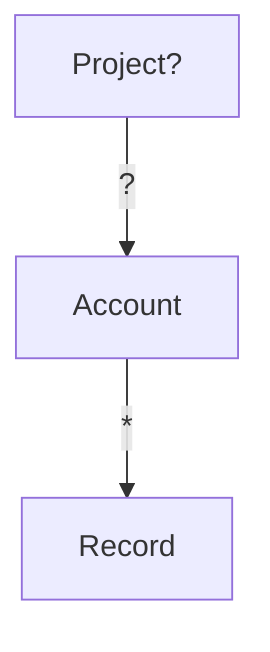
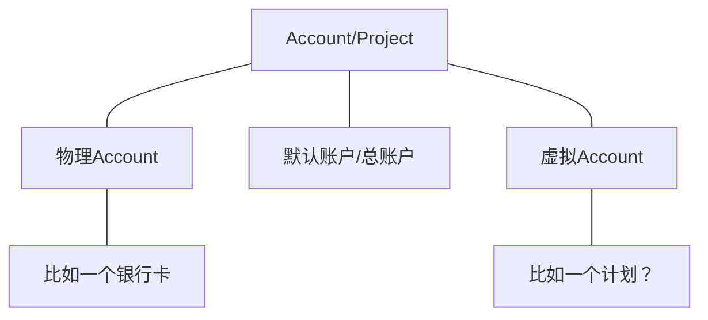
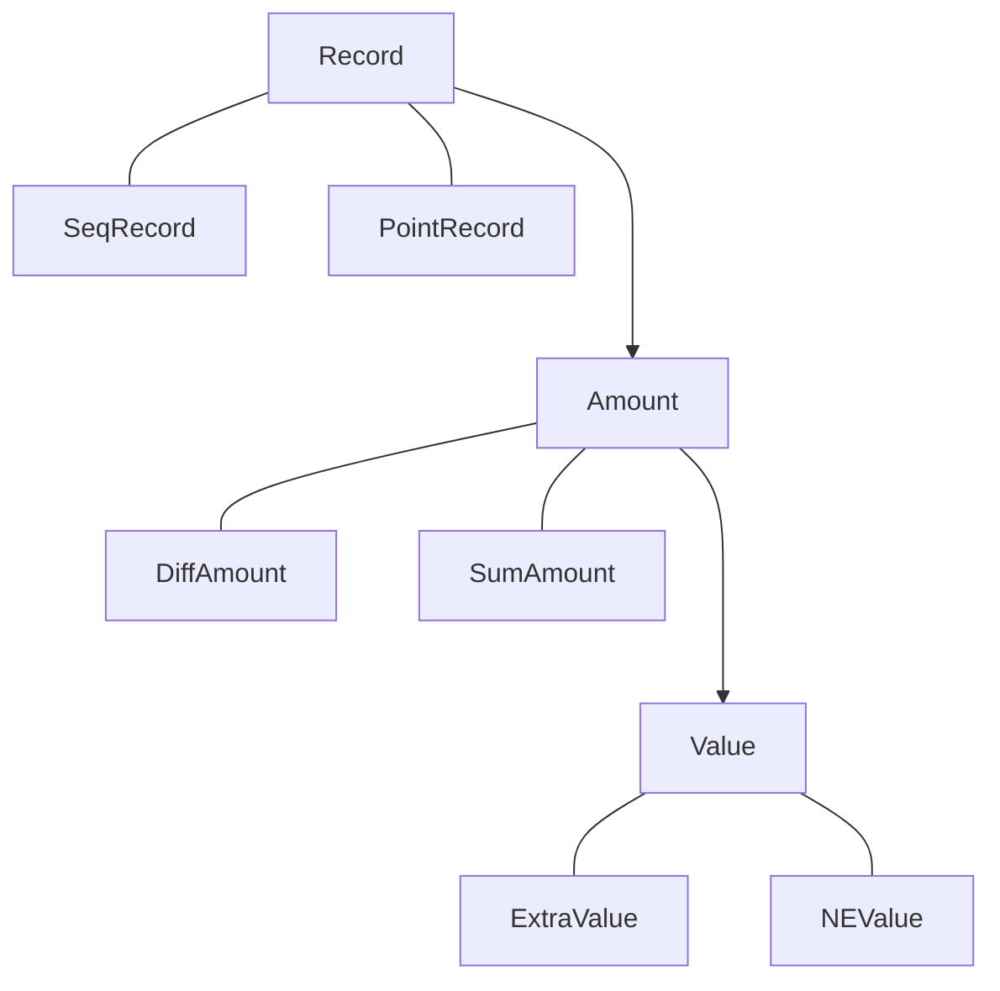
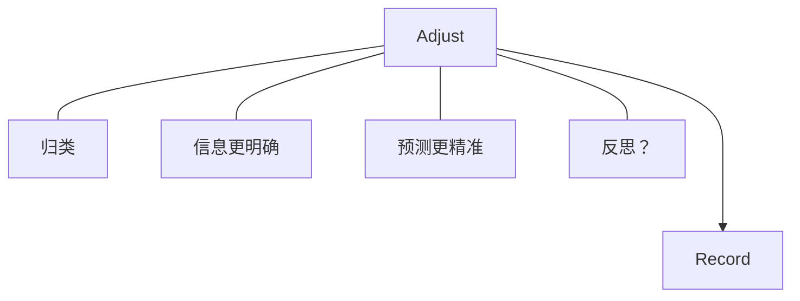
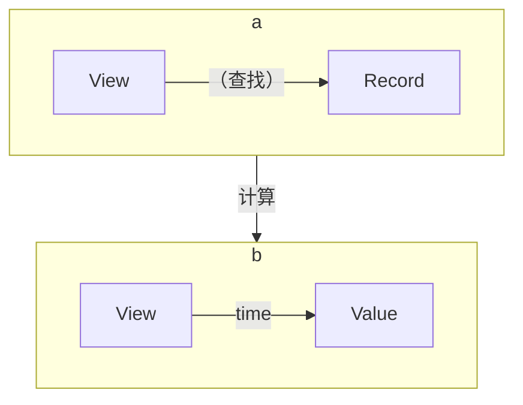
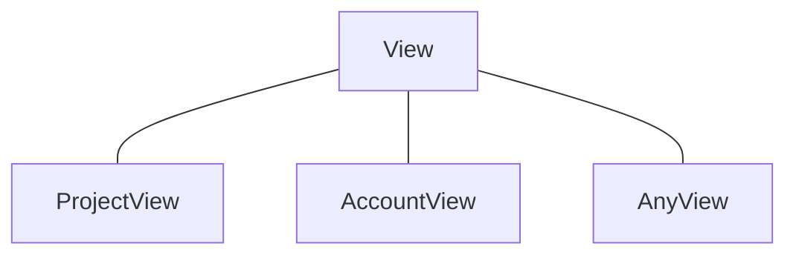

### 账户与计划

如果项目和账户是一个量级的，那么账户之间的关系可能不是树形。
但计划跟账户可能存在总和的关系，比如我工资收入（作为一个项目）跟工资卡的关系。

我一个旅行项目跟工资卡的关系，旅行项目（计划）的金额是在工资卡里面的。但我要随时关注这两个分别有多少钱。

### 记录的多种形式

对应于用户的输入形式，也就是用户记录时所具备的信息/知识。
Project和Account都有一个最大默认值，类似于universal。所以输入时不需要清楚。这个是产品价值观确定的。
Adjust是对输入的调整。但不会覆盖输入。

### 调整
Adjust是对输入的调整。但不会覆盖输入。
//TODO 可能每种record都有对应的调整。包括每种金额，每种值。

### View
view就是一些Record（及其调整）的集合，由此计算的币值时间轴。

##### view的use case
view的最重要case就是：我的钱够不够。就是ProjectView。这是产品价值观的规定。

